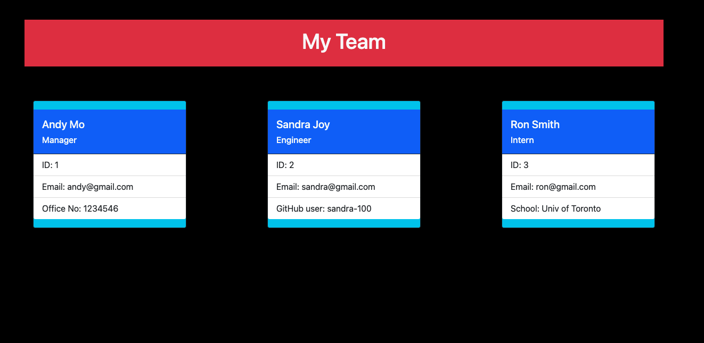

# team-creator

## [Walkthrough Video](https://drive.google.com/file/d/14WiXhSgW0He9_TS6H7k_-zp0GM_j8dwR/view?usp=sharing)

## [GitHub Url](https://github.com/harry-100/team-creator)

## Description

This is a node based application to generate team profile based on the user input. The user input is captured by 'inquirer' package. The app uses OOP ( Object Oriented Programming) concepts. TDD (Test Driven Development) methodology has been followed to develop this app. The application can be invoked by using the following command in the terminal

`node index.js`

## Table of Contents

* [Usage](#Usage)
* [License](#License)
* [ScreenShots](#ScreenShots)
* [Questions](#Questions)

## Usage
This app can be used to generate a team profile based on the user input. You can invoke this app by typing `node index.js` on the terminal. Once, all the required information is entered, the app generates a well styled html page which displays the team profile.

## License
This application is covered under [MIT](
      https://opensource.org/licenses/MIT
      ) license.

## ScreenShots

## Questions
If you need more information, please checkout my [github account](https://github.com/harry-100). You can also reach me via [email](mailto:harvinder.shah@gmail.com?subject=README%20Generator).